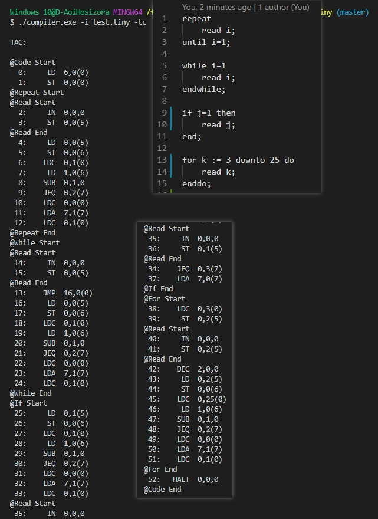

## 编译原理第三次实验说明

### 运行

```bash
./compiler.exe -i example.tiny -ct
```

+ `USAGE: compiler -i <filename> [pscth]`
	+ -i 指定输入 Tiny 代码
	+ -p 输出语法树
	+ -s 输出符号表
	+ -t 输出注释
	+ -c 输出三地址码
	+ -h 输出帮助

### 编译

```bash
# 修改 makefile 内的 LEX 与 YACC 设置

# lex 生成 lex.yy.c
make lex

# yacc 生成 tiny.tab.c 并 sed 修改 getToken()
make yacc

# 编译源码
make && make clean
```

### 运行截图

